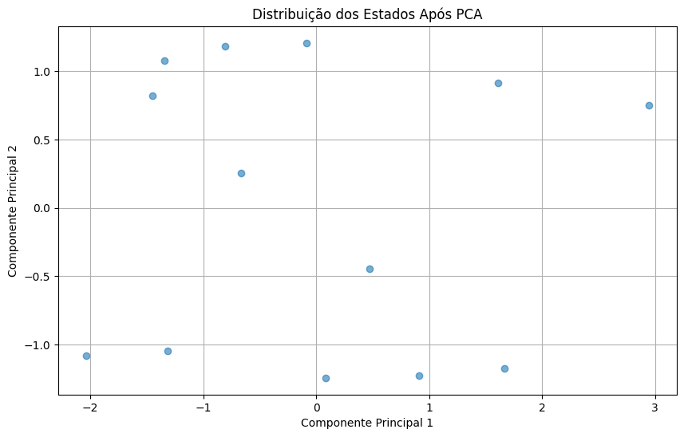
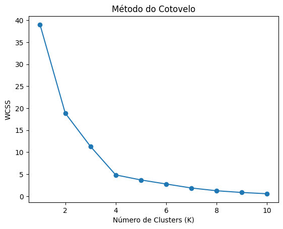

# 📊 Análise de Saturação e Oportunidades no Mercado Imobiliário

## 📌 Sobre o Projeto
Este projeto visa analisar a relação entre o número de empresas do setor imobiliário e a população de 38 a 58 anos no Brasil entre **2007 e 2022**. Aplicamos técnicas avançadas de **ciência de dados**, como modelagem de séries temporais, **Análise de Componentes Principais (PCA)** e **Clusterização K-Means**, para identificar **mercados saturados e regiões com oportunidades de crescimento**.

## 🚀 Metodologia

🔹 **Coleta de Dados**: Extração via API do IBGE e processamento de planilhas populacionais 📈  
🔹 **Análise Temporal**: Modelagem ARIMA para prever valores de 2021 e 2022 ⏳  
🔹 **PCA**: Redução de dimensionalidade para melhorar a segmentação dos estados 🔍  
🔹 **Clusterização K-Means**: Agrupamento dos estados em clusters estratégicos 🏙️  
🔹 **Insights**: Identificação de regiões saturadas e com potencial de crescimento 🏡  

## 📊 Visualizações
### 🔹 PCA - Distribuição dos Estados


### 🔹 Método do Cotovelo para Clusterização


## ⚡ Como Executar

1️⃣ Clone o repositório:
```bash
 git clone https://github.com/Erykash/perfil-consumidor-construcao.git
```
2️⃣ Instale as dependências:
```bash
 pip install -r requirements.txt
```
3️⃣ Execute o script de análise:
```bash
 Mercado Imobiliário.py
```

## 📌 Conclusões
Os resultados mostram que **estados do Sudeste e Sul** tendem a estar mais saturados, enquanto **regiões do Norte e Centro-Oeste** apresentam maior potencial para novos investimentos. Com essa análise, investidores e empresas podem tomar decisões mais estratégicas sobre **expansão e posicionamento no mercado imobiliário brasileiro**.

---
📢 **Autor:** Eryka Carvalho da Silva  
📅 **Data:** 01 de fevereiro de 2024  
🏢 **Empresa:** beAnalytic  

🚀 **Vamos transformar dados em oportunidades!**
